# Ghost-Enhancer
Super Resolution iOS App and Super Resolution PyTorch Model

# **Ghost Enhancer Mobile Application**

The Ghost Enhancer mobile application is designed to enhance images by increasing their resolution. The app utilizes state-of-the-art neural networks, leveraging advancements in machine learning to deliver high-quality results. Its name, **Ghost Enhancer**, reflects the innovative neural network used to power this functionality.

---

## **Technologies**

The mobile application is developed using **Swift**, targeting all Apple iPhones running iOS 17. During its development, the latest tools and frameworks were utilized to ensure a native, modern application that adheres to the best practices recommended by Swift developers.

### **Key Technologies:**

#### **1. Xcode**
- Xcode, Apple's popular IDE for Swift development, was used to craft the application.
- Key features:
  - Accurate previews for user interface components.
  - Efficient code autocompletion.
  - Easy connection to physical devices for deployment and testing.
  - Simulators for a wide range of iOS devices, ensuring compatibility for **Ghost Enhancer**.

#### **2. SwiftUI**
- SwiftUI enabled a modern approach to UI design with functional programming principles.
- Benefits:
  - Increased scalability and cleaner code.
  - Reduced development time while maintaining a user-friendly interface.

#### **3. SwiftData**
- Integrated with SwiftUI, SwiftData was used for data persistence.
- Why SwiftData?
  - Versatile and robust solution for image storage.
  - Requires minimal boilerplate code.
  - Streamlines development compared to older persistence frameworks.

#### **4. CoreML**
- **CoreML** is one of the best machine-learning frameworks designed to optimize model performance on iOS, macOS, and other Apple platforms.
- Features:
  - Native solution with seamless integration into Xcode.
  - Enables previews of machine learning models within the IDE to ensure proper functionality.
- **Model Integration:**
  - The neural network model, originally built with PyTorch, was converted to CoreML format using the **CoreML Converter Tool**.
  - This streamlined the deployment of the model within the Apple ecosystem.

---

## **Application Flows**

The Ghost Enhancer application is designed to provide a seamless and minimalistic user experience while offering robust image enhancement functionalities. Below are the primary user flows:

---

### **1. Home Screen**
- **Overview**:
  - The application opens on the **Home Screen**, displaying a list of albums.
  - The most recently created album is highlighted at the top, while other albums are sorted in descending order by creation date.
- **User Actions**:
  - Scroll through the list of albums.
  - Tap on an album to navigate to its **Album Details** page.
  - Preview the most recent enhanced image from each album.
 

  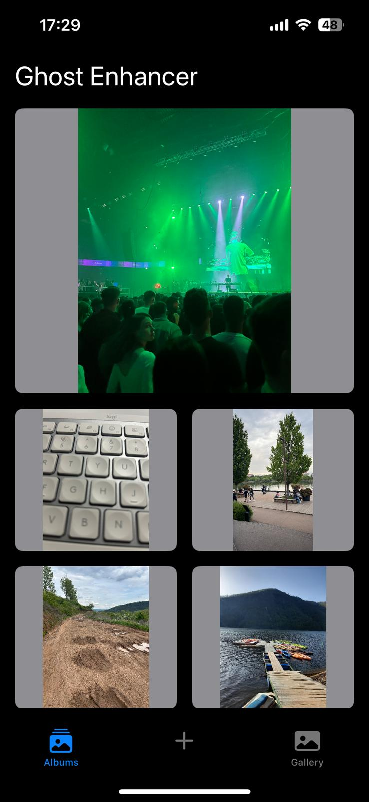
  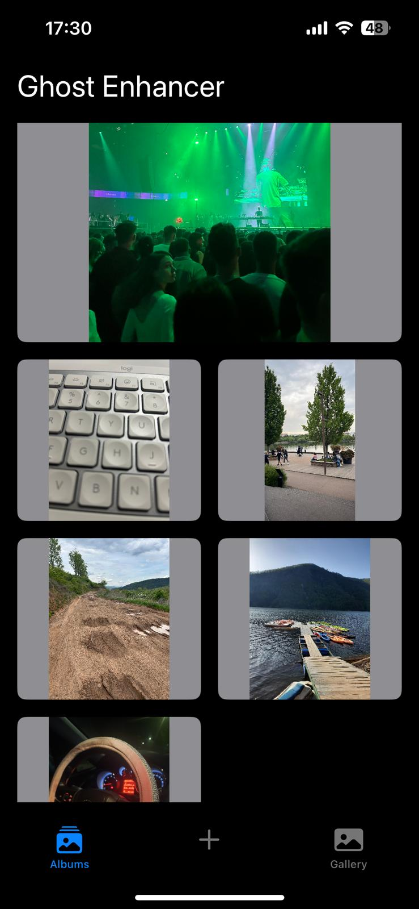

---

### **2. Album Details**
- **Overview**:
  - Displays all enhanced photos from a selected album.
  - The most recent enhanced image is highlighted at the top, followed by a horizontally scrollable list of other images.
- **User Actions**:
  - Scroll through images.
  - Edit the album title by tapping on it.
  - Add new images to the album via:
    - **Photo Upload**: Select an image from the phone gallery.
    - **Camera Capture**: Capture an image using the device camera.
  - Tap on any image to open the **Photo Viewer**.

  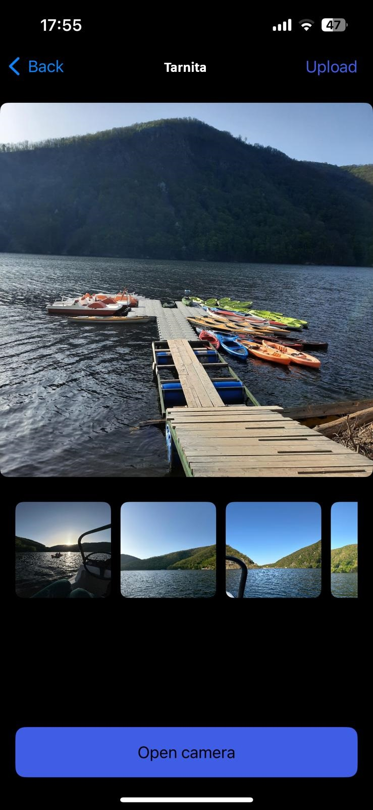
  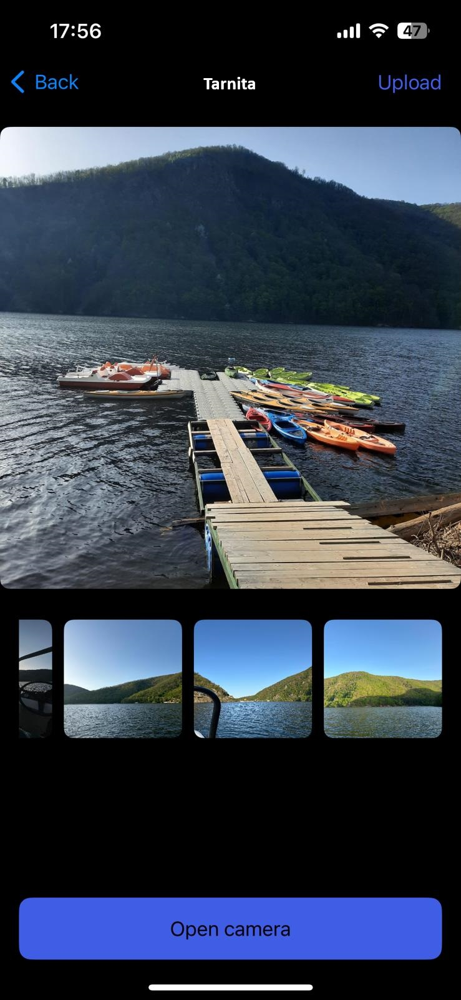

---

### **3. Photo Viewer**
- **Overview**:
  - Allows the user to view the enhanced image alongside the original image.
  - Includes options for sharing, deleting, and zooming images.
- **User Actions**:
  - **Zoom**: Pinch to zoom in/out to inspect image details.
  - **Switch Views**: Toggle between the enhanced and original images.
  - **Share**: Export both the original and enhanced images.
  - **Delete**: Remove both the enhanced and original images from the album.

  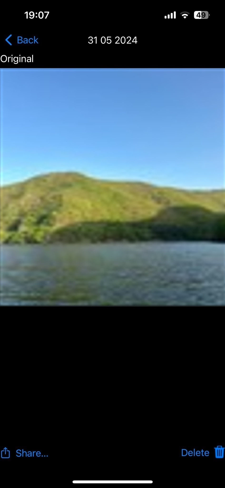
  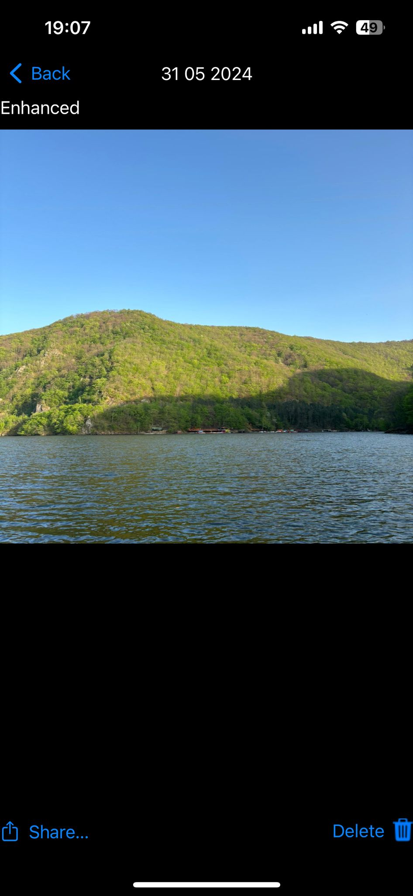

---

### **4. Gallery Screen**
- **Overview**:
  - Displays all processed images across all albums.
  - Images are sorted in descending order by the date they were processed.
- **User Actions**:
  - Scroll through the gallery.
  - Tap on an image to open the **Photo Viewer** for detailed interaction.

  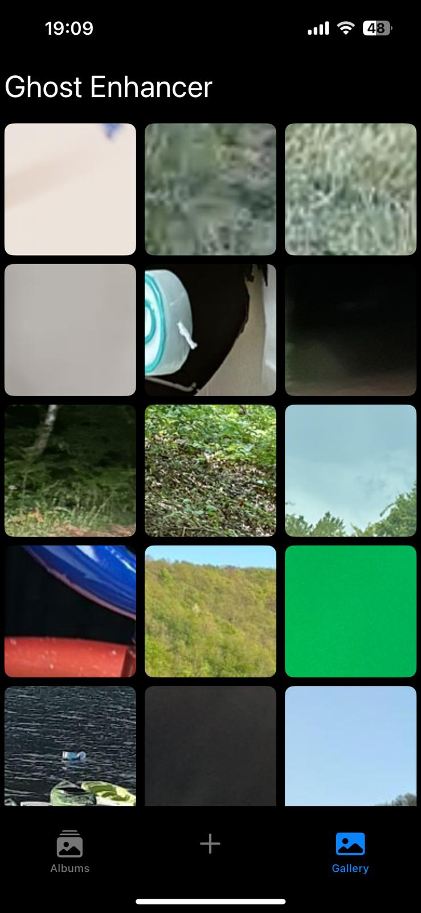

---

### **5. Adding Photos**
- **Photo Upload**:
  - Select images from the phone's gallery to enhance.
  
  

  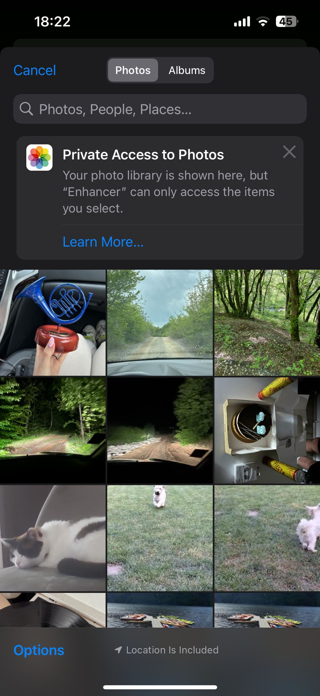

- **Camera Capture**:
  - Use the camera to capture and enhance photos directly within the app.
  - Especially useful for digitizing old physical photos.

  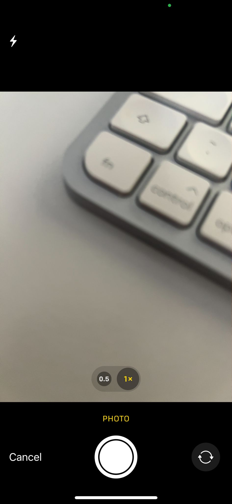
  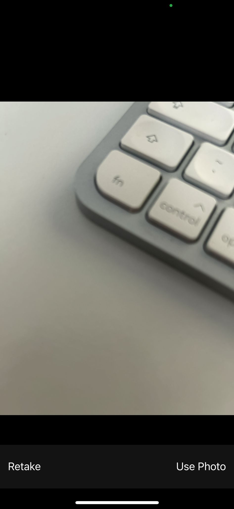

---

---

# **Ghost Enhancer Neural Network Model**

## **Generator Architecture**

### **Key Improvements**
- **Ghost Bottlenecks:** 
  - Replace Residual Blocks from SRGAN to reduce computational complexity.
  - Create a compact model without sacrificing performance.

- **Self-Attention with Multi-Head Layers (SA GhostSRGAN):**
  - Introduce Multi-head Attention Layers after each Ghost Bottleneck.
  - Improve image quality by capturing pixel-level dependencies.
  - Reduce overfitting risks using aggregated information from multiple perspectives.

---

### **Pipeline Overview**
1. **Initial Convolution:**
   - A convolutional layer with a kernel size of 9 extracts features from the input image.
   - Outputs 64 feature channels, followed by a **Parametric Rectified Linear Unit (PReLU)** layer.

2. **Core Architecture:**
   - **Ghost Bottlenecks:**
     - Efficient feature extraction with skip connections to Self-Attention Layers in SA GhostSRGAN.
   - **Multi-Head Attention Layers (SA GhostSRGAN):**
     - Aggregate data from multiple perspectives for robust feature learning.

3. **Post-Attention Layers:**
   - A sequence of:
     - **Convolutional Layer** → **Batch Normalization** → **Elementwise Sum**.
   - Ensures consistency in feature map dimensions.

4. **Upsampling:**
   - Two upsampling passes:
     - **Convolutional Layer** → **PixelShuffle** → **Parametric ReLU**.
   - A final convolution generates the output image.

---

## **Discriminator Architecture**

### **GhostSRGAN Discriminator**
1. **Initial Layers:**
   - A Convolutional Layer (kernel size = 3) followed by **Leaky ReLU activation**.

2. **Basic Blocks:**
   - Seven blocks, each containing:
     - A Convolutional Layer (kernel size = 3, stride = 2).
   - Extracts hierarchical features from the input image.

3. **Dense Layers:**
   - A Dense Layer after the final Basic Block.
   - Output processed through:
     - **Leaky ReLU activation** → **Sigmoid activation** for final classification.

---

### **SA GhostSRGAN Discriminator**
- **Enhancement:**
  - Adds a **Multi-Head Attention Layer** after every Basic Block.
  - Improves feature extraction and representation learning.

---

## **Architectural Diagram**
SA GhostSRGAN:

  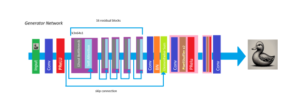

---

## **Summary**
- GhostSRGAN and SA GhostSRGAN improve upon SRGAN by introducing Ghost Bottlenecks and Self-Attention mechanisms.
- SA GhostSRGAN incorporates Multi-Head Attention to capture dependencies more effectively and prevent overfitting.
- The architectures are lightweight and designed for high-performance image super-resolution.
